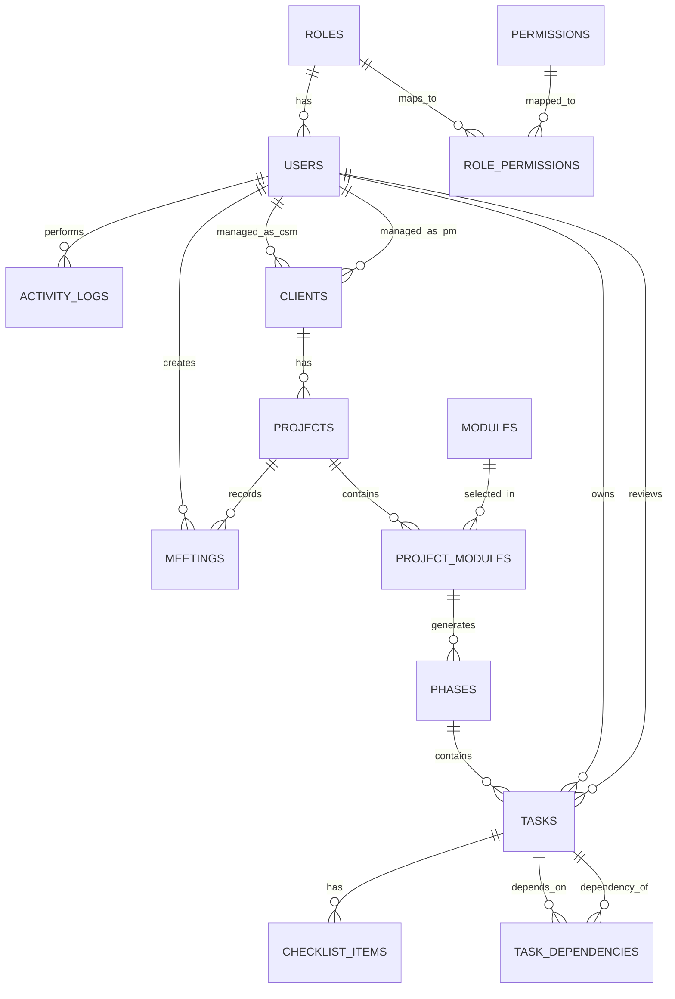

# Implementation Management System — Entity Relationship Diagram

## Overview

This ERD reflects the current IMS schema as defined in `backend/app/models.py`. It includes the core implementation hierarchy, user/role management, the permission matrix, audit logging, and soft-delete support.

---

## Mermaid ERD

---

## Entity Definitions

### `roles`

| Column | Type | Notes |
|--------|------|-------|
| id | integer PK | |
| name | varchar(50) UQ | e.g. Administrator, Project Manager, Client |
| description | varchar(255) | |

### `permissions`

| Column | Type | Notes |
|--------|------|-------|
| id | integer PK | |
| code | varchar(80) UQ | `resource.action`, e.g. `client.create`, `task.delete` |
| name | varchar(120) | Human-readable label |
| description | varchar(255) | |
| category | varchar(50) | e.g. Clients, Tasks, System |

### `role_permissions`

| Column | Type | Notes |
|--------|------|-------|
| role_id | integer PK, FK → roles | |
| permission_id | integer PK, FK → permissions | |
| created_at | timestamp | |

### `users`

| Column | Type | Notes |
|--------|------|-------|
| id | integer PK | |
| name | varchar(100) | |
| email | varchar(255) UQ | |
| hashed_password | varchar(255) | bcrypt hash |
| role_id | integer FK → roles | |
| is_active | boolean | Default `true`; inactive users cannot log in |
| is_deleted | boolean | Soft-delete flag |
| deleted_at | timestamp | |
| created_at | timestamp | |
| updated_at | timestamp | |

### `clients`

| Column | Type | Notes |
|--------|------|-------|
| id | integer PK | |
| name | varchar(150) | |
| crm_id | varchar(50) | External CRM reference |
| institution_type | varchar(100) | University / College / School |
| status | varchar(30) | Active, On Hold, Completed, Churned |
| priority | varchar(20) | Critical, High, Medium, Low |
| contract_start | date | |
| contract_end | date | |
| go_live_date | date | |
| csm_id | integer FK → users | Customer Success Manager |
| pm_id | integer FK → users | Project Manager |
| sales_owner | varchar(100) | |
| is_deleted | boolean | Soft-delete flag |
| deleted_at | timestamp | |
| created_at | timestamp | |
| updated_at | timestamp | |

### `projects`

| Column | Type | Notes |
|--------|------|-------|
| id | integer PK | |
| client_id | integer FK → clients | |
| name | varchar(150) | |
| description | text | |
| type | varchar(50) | New Implementation, Additional Module, Migration, etc. |
| status | varchar(30) | Not Started, In Progress, On Hold, Completed, Cancelled |
| start_date | date | |
| end_date | date | |
| progress | float | 0–100, derived from modules |
| is_deleted | boolean | Soft-delete flag |
| deleted_at | timestamp | |
| created_at | timestamp | |
| updated_at | timestamp | |

### `modules`

| Column | Type | Notes |
|--------|------|-------|
| id | integer PK | |
| name | varchar(100) UQ | Admissions, Finance, LMS, etc. |
| category | varchar(50) | Academic, Administrative, Engagement, etc. |
| description | varchar(255) | |
| is_deleted | boolean | |
| deleted_at | timestamp | |

### `project_modules`

| Column | Type | Notes |
|--------|------|-------|
| id | integer PK | |
| project_id | integer FK → projects | |
| module_id | integer FK → modules | |
| status | varchar(30) | Not Started, In Progress, etc. |
| progress | float | 0–100, derived from tasks |
| is_deleted | boolean | |
| deleted_at | timestamp | |
| created_at | timestamp | |

### `phases`

| Column | Type | Notes |
|--------|------|-------|
| id | integer PK | |
| project_module_id | integer FK → project_modules | |
| name | varchar(100) | e.g. Discovery, Configuration, Training |
| sequence | integer | Display order |
| is_deleted | boolean | |
| deleted_at | timestamp | |

### `tasks`

| Column | Type | Notes |
|--------|------|-------|
| id | integer PK | |
| phase_id | integer FK → phases | |
| parent_task_id | integer FK → tasks | Nullable; supports sub-tasks |
| owner_id | integer FK → users | |
| reviewer_id | integer FK → users | |
| title | varchar(200) | |
| description | text | |
| priority | varchar(20) | Critical, High, Medium, Low |
| status | varchar(30) | Not Started, In Progress, Completed, Cancelled, etc. |
| start_date | date | |
| due_date | date | |
| estimated_hours | float | |
| actual_hours | float | |
| progress | float | 0–100 |
| sequence | integer | Manual drag-and-drop order |
| is_deleted | boolean | |
| deleted_at | timestamp | |
| created_at | timestamp | |
| updated_at | timestamp | |

### `checklist_items`

| Column | Type | Notes |
|--------|------|-------|
| id | integer PK | |
| task_id | integer FK → tasks | |
| item | varchar(255) | Description |
| completed | boolean | |
| is_deleted | boolean | |
| deleted_at | timestamp | |

### `task_dependencies`

| Column | Type | Notes |
|--------|------|-------|
| id | integer PK | |
| task_id | integer FK → tasks | The task that has a dependency |
| depends_on_task_id | integer FK → tasks | The prerequisite task |

### `meetings`

| Column | Type | Notes |
|--------|------|-------|
| id | integer PK | |
| project_id | integer FK → projects | |
| title | varchar(200) | |
| meeting_date | date | |
| participants | varchar(255) | Comma-separated names |
| discussion | text | Minutes of Meeting |
| decisions | text | |
| action_items | text | |
| next_follow_up | date | |
| created_by | integer FK → users | |
| is_deleted | boolean | |
| deleted_at | timestamp | |
| created_at | timestamp | |
| updated_at | timestamp | |

### `activity_logs`

| Column | Type | Notes |
|--------|------|-------|
| id | integer PK | |
| user_id | integer FK → users | Nullable |
| entity | varchar(50) | client, project, task, meeting, etc. |
| action | varchar(50) | create, update, delete, restore |
| timestamp | timestamp | |
| details | text | Human-readable description |

---

## Key Relationships

| Parent | Child | Type | Notes |
|--------|-------|------|-------|
| roles | users | 1:N | A user has one role |
| roles | role_permissions | M:N via `role_permissions` | Maps roles to fine-grained permissions |
| permissions | role_permissions | M:N via `role_permissions` | |
| users | clients | 1:N (csm_id) | CSM assignment |
| users | clients | 1:N (pm_id) | PM assignment |
| clients | projects | 1:N | |
| projects | project_modules | 1:N | Modules selected for a project |
| modules | project_modules | 1:N | Master catalogue reused across projects |
| project_modules | phases | 1:N | Auto-generated implementation plan |
| phases | tasks | 1:N | |
| tasks | checklist_items | 1:N | |
| tasks | task_dependencies | 1:N | Self-referencing task prerequisites |
| tasks | tasks | 1:N (parent_task_id) | Sub-task hierarchy |
| users | tasks | 1:N (owner_id) | |
| users | tasks | 1:N (reviewer_id) | |
| projects | meetings | 1:N | Meeting & communication log |
| users | meetings | 1:N (created_by) | |
| users | activity_logs | 1:N | Audit trail |

---

## Soft Delete Behaviour

All core entities (`users`, `clients`, `projects`, `project_modules`, `phases`, `tasks`, `checklist_items`, `modules`, `meetings`) use soft deletes via `is_deleted` + `deleted_at`. When a parent is deleted, child rows are typically soft-deleted in the same transaction (e.g. deleting a client soft-deletes its projects, modules, phases, tasks, and checklist items).

Deleted items remain in the `recycle_bin` for 12 hours and can be restored by users with `recycle_bin.restore` permission before the window expires.
