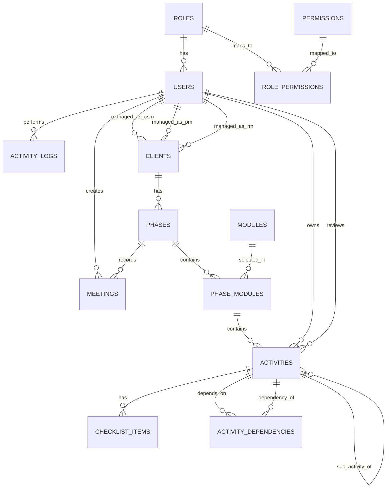

# Implementation Management System — Entity Relationship Diagram

## Overview

This ERD reflects the current IMS schema as defined in `backend/app/models.py`. The implementation hierarchy is:

```
Client → Phase → PhaseModule → Activity → ChecklistItem
                        │
                    (Module catalogue)
Phase → Meeting (meeting & communication log, attached directly to a phase)
```

It also covers user/role management, the fine-grained permission matrix, audit logging, and soft-delete support.

---

## Mermaid ERD


```mermaid
erDiagram
    ROLES ||--o{ USERS : has
    ROLES ||--o{ ROLE_PERMISSIONS : maps_to
    PERMISSIONS ||--o{ ROLE_PERMISSIONS : mapped_to
    USERS ||--o{ ACTIVITY_LOGS : performs
    USERS ||--o{ MEETINGS : creates
    USERS ||--o{ CLIENTS : managed_as_csm
    USERS ||--o{ CLIENTS : managed_as_pm
    USERS ||--o{ CLIENTS : managed_as_rm
    CLIENTS ||--o{ PHASES : has
    PHASES ||--o{ PHASE_MODULES : contains
    PHASES ||--o{ MEETINGS : records
    MODULES ||--o{ PHASE_MODULES : selected_in
    PHASE_MODULES ||--o{ ACTIVITIES : contains
    ACTIVITIES ||--o{ CHECKLIST_ITEMS : has
    ACTIVITIES ||--o{ ACTIVITY_DEPENDENCIES : depends_on
    ACTIVITIES ||--o{ ACTIVITY_DEPENDENCIES : dependency_of
    ACTIVITIES ||--o{ ACTIVITIES : sub_activity_of
    USERS ||--o{ ACTIVITIES : owns
    USERS ||--o{ ACTIVITIES : reviews
```

---

## Entity Definitions

### `roles`

| Column | Type | Notes |
|--------|------|-------|
| id | integer PK | |
| name | varchar(50) UQ | Administrator, Customer Success Manager, Project Manager, Implementation Executive, Data Team, Support Team, Management, Client |
| description | varchar(255) | |

### `permissions`

| Column | Type | Notes |
|--------|------|-------|
| id | integer PK | |
| code | varchar(80) UQ | `resource.action`, e.g. `client.create`, `activity.delete` |
| name | varchar(120) | Human-readable label |
| description | varchar(255) | |
| category | varchar(50) | System, Users, Clients, Phases, Modules, Activities, Meetings |

### `role_permissions`

| Column | Type | Notes |
|--------|------|-------|
| role_id | integer PK, FK → roles | |
| permission_id | integer PK, FK → permissions | |
| created_at | timestamp | |

### `users`

| Column | Type | Notes |
|--------|------|-------|
| id | integer PK | |
| name | varchar(100) | |
| email | varchar(255) UQ | |
| hashed_password | varchar(255) | bcrypt hash |
| role_id | integer FK → roles | |
| is_active | boolean | Default `true`; inactive users cannot log in |
| is_deleted | boolean | Soft-delete flag |
| deleted_at | timestamp | |
| created_at | timestamp | |
| updated_at | timestamp | |

### `clients`

| Column | Type | Notes |
|--------|------|-------|
| id | integer PK | |
| name | varchar(150) | |
| crm_id | varchar(50) | External CRM reference |
| institution_type | varchar(100) | |
| status | varchar(30) | Active, On Hold, Completed, Churned |
| priority | varchar(20) | Critical, High, Medium, Low |
| contract_start | date | |
| contract_end | date | |
| go_live_date | date | |
| csm_id | integer FK → users | Customer Success Manager |
| pm_id | integer FK → users | Project Manager |
| rm_id | integer FK → users | Relationship Manager |
| sales_owner | varchar(100) | |
| instance_link | varchar(500) | Link to client's live instance |
| region | varchar(50) | |
| implementation_state | varchar(50) | Set to `"Go Live"` automatically when every activity across the client is completed |
| new_recurring | varchar(20) | New / Recurring |
| kickoff_meeting_date | date | |
| agreed_go_live_date | date | Contractually agreed go-live |
| billing_date | date | Login credentials sent / billing start |
| tracker_link | varchar(500) | External tracker (e.g. Google Sheets) |
| master_data_status | varchar(100) | |
| total_users | integer | |
| is_deleted | boolean | Soft-delete flag |
| deleted_at | timestamp | |
| created_at | timestamp | |
| updated_at | timestamp | |

### `phases`

A client implementation phase (this replaced the earlier "Project" concept — see `models.py` docstring).

| Column | Type | Notes |
|--------|------|-------|
| id | integer PK | |
| client_id | integer FK → clients | |
| name | varchar(150) | |
| description | text | |
| type | varchar(50) | Default `"New Implementation"` |
| status | varchar(30) | Not Started, In Progress, On Hold, Completed, Cancelled — derived automatically from module progress unless manually set to On Hold/Cancelled |
| start_date | date | |
| end_date | date | |
| progress | float | 0–100, derived from `phase_modules` |
| is_deleted | boolean | Soft-delete flag |
| deleted_at | timestamp | |
| created_at | timestamp | |
| updated_at | timestamp | |

### `modules`

Master catalogue of implementable modules (Admissions, Finance, LMS, etc.), seeded on startup.

| Column | Type | Notes |
|--------|------|-------|
| id | integer PK | |
| name | varchar(100) UQ | |
| category | varchar(50) | Onboarding, Core, Academic, Administrative, Infrastructure, Engagement, Support, Other, Integration |
| description | varchar(255) | |
| is_deleted | boolean | |
| deleted_at | timestamp | |

### `phase_modules`

A module selected for a specific phase — an "instance" of a catalogue module. Adding one auto-generates its default activities from `MODULE_ACTIVITY_TEMPLATES`.

| Column | Type | Notes |
|--------|------|-------|
| id | integer PK | |
| phase_id | integer FK → phases | |
| module_id | integer FK → modules | |
| status | varchar(30) | Not Started, In Progress, Completed — derived from activity progress |
| progress | float | 0–100, derived from `activities` (average, excluding Cancelled) |
| is_deleted | boolean | |
| deleted_at | timestamp | |
| created_at | timestamp | |

### `activities`

A single implementation activity within a module (this replaced the earlier "Task" concept).

| Column | Type | Notes |
|--------|------|-------|
| id | integer PK | |
| phase_module_id | integer FK → phase_modules | |
| parent_activity_id | integer FK → activities | Nullable; supports sub-activities |
| owner_id | integer FK → users | |
| reviewer_id | integer FK → users | |
| title | varchar(200) | |
| description | text | |
| priority | varchar(20) | Critical, High, Medium, Low |
| status | varchar(30) | Not Started, In Progress, Completed, Cancelled, etc. (free text) |
| start_date | date | |
| due_date | date | |
| estimated_hours | float | |
| actual_hours | float | |
| progress | float | 0–100 |
| sequence | integer | Manual/drag-and-drop display order |
| client_spoc | varchar(150) | Client-side single point of contact |
| client_spoc_email | varchar(255) | |
| client_spoc_phone | varchar(50) | |
| uat_proposed | boolean | |
| delay_reason | text | |
| client_response | text | |
| internal_response | text | |
| external_link | varchar(500) | |
| category | varchar(50) | Default `"Regular"` |
| proposed_timeline | date | |
| module_status | varchar(100) | Free-text status label mapped from the manual Excel project plan |
| is_deleted | boolean | |
| deleted_at | timestamp | |
| created_at | timestamp | |
| updated_at | timestamp | |

### `checklist_items`

| Column | Type | Notes |
|--------|------|-------|
| id | integer PK | |
| activity_id | integer FK → activities | |
| item | varchar(255) | Description |
| completed | boolean | |
| is_deleted | boolean | |
| deleted_at | timestamp | |

Checklist completion is a manual tracking aid — it does **not** feed into activity/module/phase progress calculations.

### `activity_dependencies`

| Column | Type | Notes |
|--------|------|-------|
| id | integer PK | |
| activity_id | integer FK → activities | The activity that has a dependency |
| depends_on_activity_id | integer FK → activities | The prerequisite activity |

> This table exists in the schema but is **not yet exposed** through any API endpoint or the frontend — there is no way to create or enforce a dependency today.

### `meetings`

Meeting & communication log (MoMs, decisions, action items), attached directly to a phase.

| Column | Type | Notes |
|--------|------|-------|
| id | integer PK | |
| phase_id | integer FK → phases | |
| title | varchar(200) | |
| meeting_date | date | |
| participants | varchar(255) | Comma-separated names |
| discussion | text | Minutes of Meeting |
| decisions | text | |
| action_items | text | |
| next_follow_up | date | |
| created_by | integer FK → users | |
| is_deleted | boolean | |
| deleted_at | timestamp | |
| created_at | timestamp | |
| updated_at | timestamp | |

### `activity_logs`

| Column | Type | Notes |
|--------|------|-------|
| id | integer PK | |
| user_id | integer FK → users | Nullable |
| entity | varchar(50) | client, phase, phase_module, activity, meeting, user, role, etc. |
| action | varchar(50) | create, update, delete, restore, reorder |
| timestamp | timestamp | |
| details | text | Human-readable description |

---

## Key Relationships

| Parent | Child | Type | Notes |
|--------|-------|------|-------|
| roles | users | 1:N | A user has one role |
| roles | role_permissions | M:N via `role_permissions` | Fine-grained permission mapping |
| permissions | role_permissions | M:N via `role_permissions` | |
| users | clients | 1:N (csm_id / pm_id / rm_id) | CSM, PM, and Relationship Manager assignment |
| clients | phases | 1:N | Cascade soft-delete |
| phases | phase_modules | 1:N | Modules selected for a phase |
| modules | phase_modules | 1:N | Master catalogue reused across phases |
| phase_modules | activities | 1:N | Auto-generated from the module's activity template |
| activities | checklist_items | 1:N | |
| activities | activity_dependencies | 1:N | Self-referencing (schema only, not yet used) |
| activities | activities | 1:N (parent_activity_id) | Sub-activity hierarchy |
| users | activities | 1:N (owner_id / reviewer_id) | |
| phases | meetings | 1:N | Meeting & communication log |
| users | meetings | 1:N (created_by) | |
| users | activity_logs | 1:N | Audit trail |

---

## Soft Delete Behaviour

All core entities (`users`, `clients`, `phases`, `phase_modules`, `activities`, `checklist_items`, `modules`, `meetings`) use soft deletes via `is_deleted` + `deleted_at`. Deleting a parent cascades a soft-delete to its children in the same transaction (e.g. deleting a client soft-deletes its phases, phase modules, activities, checklist items, and meetings).

Deleted items remain visible in the Recycle Bin for **12 hours** and can be restored by users with the `recycle_bin.restore` permission before the window expires. Restoring an item requires its parent to not itself be deleted (e.g. you must restore a client before restoring one of its phases).

---

*For column-level notes and generation rules, see `docs/IMS_Database_Design.md`. For the full request/response flow, see `docs/IMS_Architecture_and_Flows.md`.*
